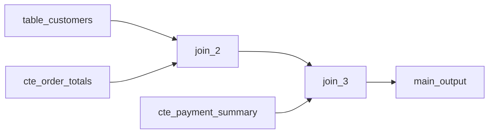

# Implementation Notes

## 2026-06-15: Avoid Mermaid as an adapter boundary

The sample SQL exposed an app-side adapter design issue rather than a confirmed `rawsql-ts` parser bug.

The first MVP adapter used `QueryFlowDiagramGenerator` and parsed its Mermaid text back into a `LineageModel`. That was the wrong boundary for the product model. Mermaid output is presentation text, not a stable data contract, and it carries process nodes optimized for Mermaid rendering.

For chained joins, the Mermaid graph can contain edges such as:

The viewer intentionally does not expose JOIN process nodes as public lineage nodes in the MVP. Parsing Mermaid meant the app had to reverse-engineer and collapse those process nodes, which dropped upstream tables or CTEs when `JOIN -> JOIN -> output` appeared.

The current adapter uses `SelectQueryParser.parse()` and reads the `rawsql-ts` AST directly:

- `CTECollector` provides CTE definitions.
- `SimpleSelectQuery.fromClause.source` provides the main source.
- `SimpleSelectQuery.fromClause.joins` provides joined sources and join types.
- CTE names are resolved to CTE nodes; other table sources become table nodes.

JOIN edges are kept in the internal lineage model and are routed from the joined source to the current query result node, not from one source to another. This keeps SELECT lineage directional: physical tables remain upstream sources, while CTEs and the final output receive incoming reference edges. The graph renderer intentionally hides JOIN edges and edge labels for now; JOIN context is only reflected on data-flow edges through dashed outer-join styling. CUD statements with `RETURNING` are a separate future scope and may need different target rules.

Column lists are populated from the AST as best-effort lineage metadata:

- CTE, derived, and output nodes use SELECT item aliases when available, direct column names when possible, and `expr_n` for unresolved expressions.
- Source table and CTE nodes receive referenced column names from SELECT, JOIN conditions, WHERE, GROUP BY, HAVING, and ORDER BY.
- Unqualified source columns are assigned only when the current query has exactly one source. Ambiguous unqualified columns are intentionally left unresolved until schema-aware resolution exists.

If this area is later moved into `rawsql-ts`, the useful API shape would be a stable graph/model output that distinguishes visible data nodes from process nodes without requiring the web app to parse Mermaid text.
