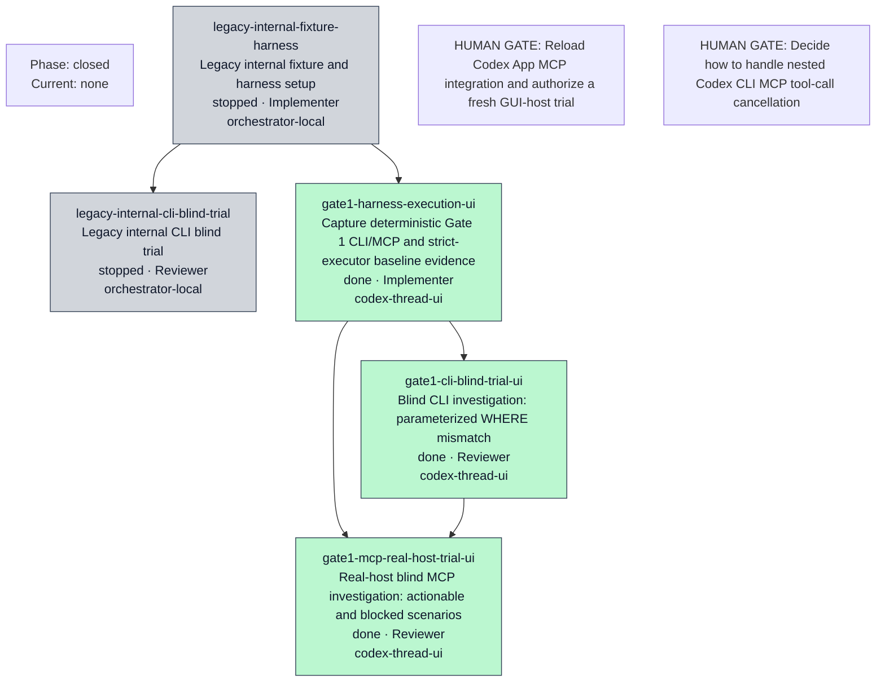
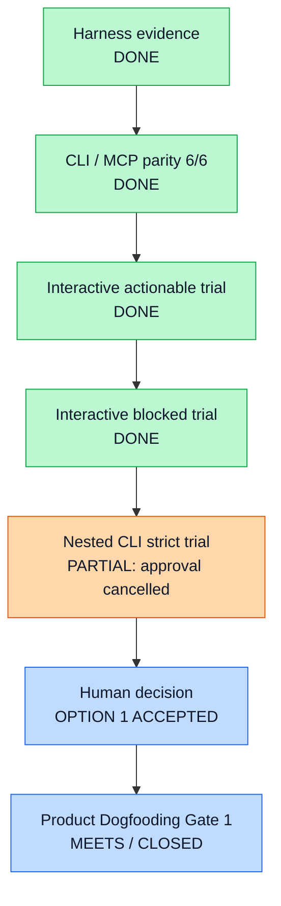

# Orchestration Progress

- Current phase: closed
- Current task: None
- Current worker thread: None
- Current transport: start=Unknown/Unknown, terminal=Unknown/Unknown, review=Unknown
- Last updated: 2026-07-15T13:43:35.638Z
- Last heartbeat: None
- Watchdog: inactive
- Next action: PRODUCT_DOGFOODING_GATE_1_MEETS_CLOSED
- Current blocker: [{"code":"BLOCKED_ENVIRONMENT","owner":"Codex App integration","detail":"Direct stdio MCP validation passed, but the fresh GUI worker tool inventory did not expose create_investigation_plan."},{"code":"MCP_TOOL_CALL_CANCELLED","owner":"Codex CLI host approval path","detail":"Nested codex exec invoked the expected MCP tool twice, but both calls returned user cancelled MCP tool call before any plan response."}]
- Human gate: [{"id":"codex-app-mcp-exposure","title":"Reload Codex App MCP integration and authorize a fresh GUI-host trial","status":"non_blocking_UNCONFIRMED","question":"Can the Codex App GUI host be restarted or reloaded and confirmed to expose the user-local rawsql-lineage-investigation-gate1 server from ~/.codex/config.toml?","recommendation":"CLI real-host trial is now the active Gate path. Keep GUI exposure as a separate UNCONFIRMED environment observation; do not change product code or the server command before GUI evidence exists."},{"id":"nested-cli-mcp-cancellation","title":"Decide how to handle nested Codex CLI MCP tool-call cancellation","status":"accepted_option_1","question":"Should the Gate accept the already human-observed interactive CLI successes as sufficient, or should a user-local MCP approval policy / interactive capture method be authorized for one clean actionable retry?","recommendation":"Human approved Option 1: interactive CLI evidence is the Gate acceptance proof; retain Attempt 5 as the non-interactive limitation. No follow-up action is authorized."}]

| Task | Status | Role | Surface | Start ACK/Receipt | Terminal/Receipt | Review | Attempt |
| --- | --- | --- | --- | --- | --- | --- | ---: |
| legacy-internal-fixture-harness | stopped | Implementer | orchestrator-local | not-required/not-required | not-required/not-required | not-required | 2 |
| legacy-internal-cli-blind-trial | stopped | Reviewer | orchestrator-local | not-required/not-required | not-required/not-required | not-required | 2 |
| gate1-harness-execution-ui | done | Implementer | codex-thread-ui | received/sent | received/sent | accepted | 2 |
| gate1-cli-blind-trial-ui | done | Reviewer | codex-thread-ui | received/sent | received/sent | accepted | 1 |
| gate1-mcp-real-host-trial-ui | done | Reviewer | codex-thread-ui | received/sent | received/sent | accepted | 5 |

## Human Decision

Human decision: **Option 1 accepted.**

Product Dogfooding Gate 1: **meets**

Accepted evidence: Interactive real-host actionable and blocked trials.

Attempt 5: **partial — non-interactive host approval limitation**

Attempt 5 behavior: The nested Codex CLI selected only `create_investigation_plan` and attempted the MCP call twice. Both calls were cancelled by the host approval path before a tool result was returned.

Product defect indicated: **no**

Safety defect indicated: **no**

Remaining limitation: unattended / non-interactive local MCP approval is unverified.

Gate status: **CLOSED**

